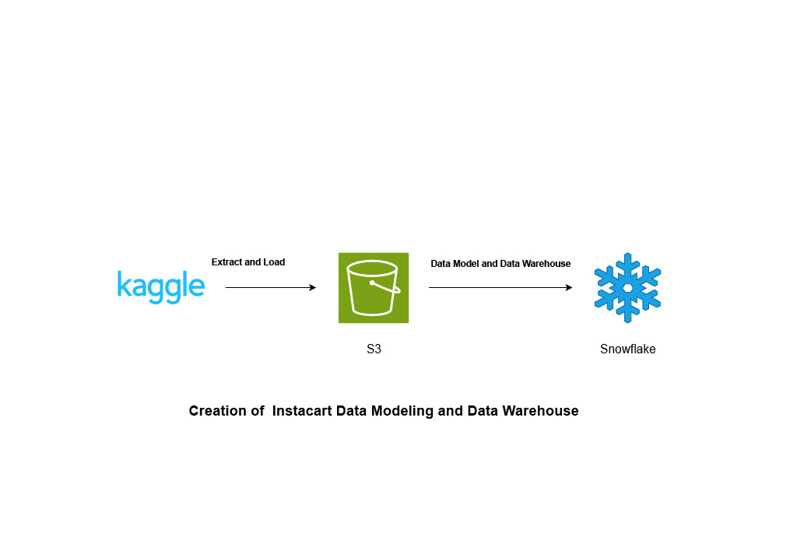

# Instacart-data-warehouse-in-snowflake
## Project Overview
This project demonstrates a complete data warehouse process, starting from data extraction from Kaggle, followed by data storage in Amazon S3, and subsequent loading into Snowflake for creating a data warehouse. The project includes designing a star schema for efficient data storage and performing data analysis in Snowflake.

## Project Workflow
### Data Extraction:
Extracted dataset from Kaggle, a popular platform for datasets and data competitions.

### Data Storage in Amazon S3:
Loaded the extracted dataset into an Amazon S3 bucket, providing a scalable storage solution.

### Integration with Snowflake:

Connected Snowflake with the S3 bucket using Snowflake's integration features.
Created a database in Snowflake and loaded the data from S3.

### Data Modeling:
Designed a star schema for the dataset to optimize querying and reporting.
Created fact and dimension tables to support business intelligence activities.

### Data Warehousing:
Implemented the star schema in Snowflake to structure the data warehouse.
Loaded and transformed the data into the respective fact and dimension tables.

### Data Analysis:
Performed data analysis within Snowflake, leveraging its SQL capabilities and scalable architecture

